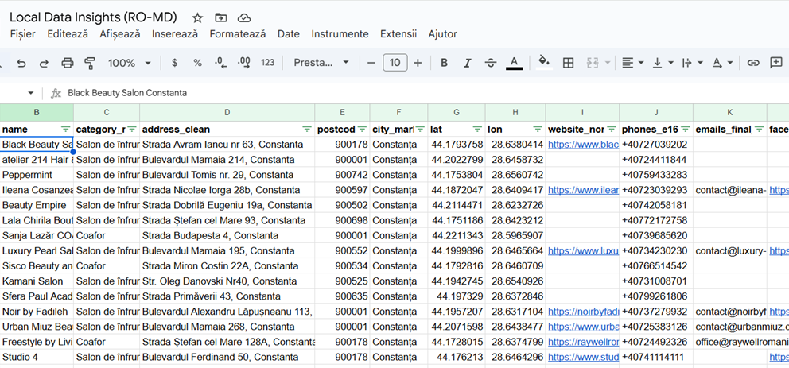

### Local Data Insights: Servicii de înfrumusețare în Constanța, România — August 2025

  

Date curate și structurate despre companiile din domeniul Serviciilor de înfrumusețare din Constanța, România.

---

### Conținut
- `cards_sample_50.csv` — eșantion (primele 50 de rânduri)  
- `cards_sample_50.xlsx` — eșantion compatibil cu Excel  
- `schema.csv` — descrierea coloanelor  
- `metrics_snapshot.md` — indicatori de calitate a datelor  
- *(opțional)* `img/csv_preview.png` — previzualizare vizuală

---

### Sursa datelor
Informațiile sunt colectate din **directoare publice de afaceri**,  
**site-uri oficiale** și **profiluri de rețele sociale**.  
Nu reprezintă un registru oficial și pot conține erori minore.  
Datele sunt oferite *ca atare*, exclusiv în scopuri analitice și de cercetare.

---

### Note
La deschiderea fișierului CSV în Excel, zerourile inițiale pot fi pierdute.  
Folosește varianta `.xlsx` sau importă coloanele  
`phones_e164`, `postcode_digits` și `entity_id` ca **Text**.

---

### Contact
**Local Data Insights**  
[localdatainsights@gmail.com](mailto:localdatainsights@gmail.com)

> Setul complet de date este disponibil la cerere.  
> Generat automat la **2025-10-27T12:19:17Z**.

